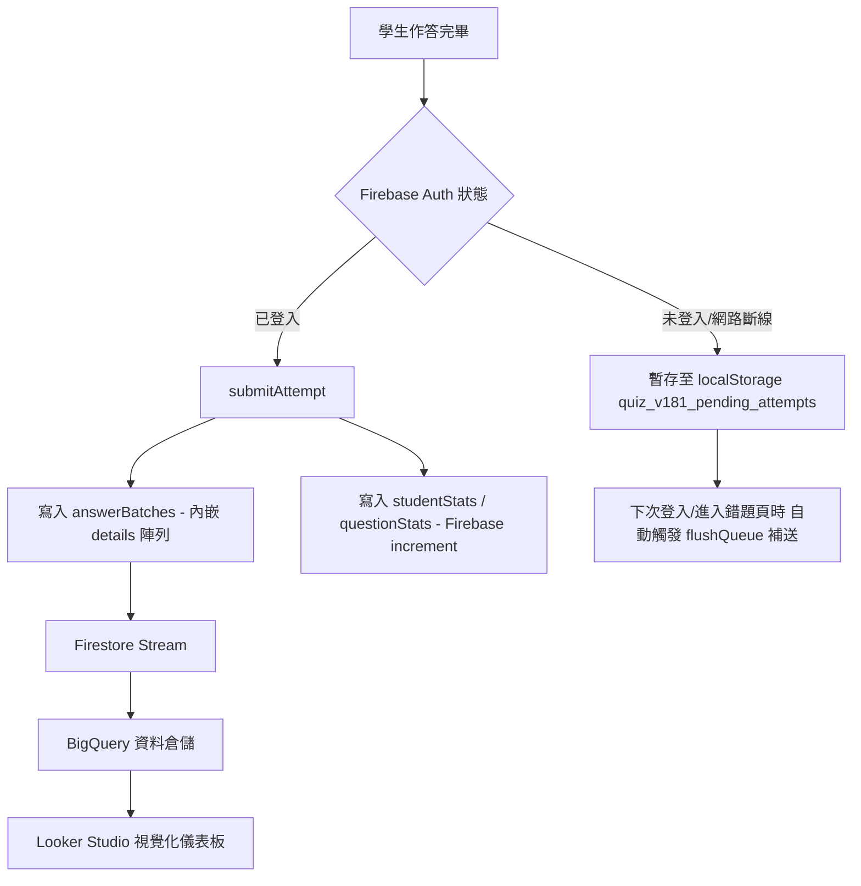

# 114-2 微免期末考系統：詳細開發歷程與變更記錄 (6/14 ～ 6/17)

本文件詳細記錄了本系統在 2026/06/14 至 2026/06/17 期間，為了因應「Google Sheet 格數爆滿危機」而進行的 **Firebase 大架構轉移**、**白名單安全登入**、以及**錯題閃卡優化與修復**的詳細開發歷程。後續若有任何開發變更，將在此文件中增量記錄。

---

## 📅 開發歷程與變更日誌 (Changelog)

### 【2026-06-17】

#### 🛠️ 1. 修正教師白名單警告之排除邏輯
* **版本號/Commit**: `294dcb0`
* **異動檔案**: 
  * [index.html](index.html) (版本號升級至 `?v=20260617k`)
* **變更目的**: 由於教師 Email (`hhchang@ctcn.edu.tw`) 在資料庫中真實不存在於 `studentsWhitelist` 集合中（因無須列入學生名冊），即便 Firestore 安全規則已對其特例放行，前端白名單自動檢測仍會無條件顯示黃色警告。本次修正直接排除教師特例之警告顯示。
* **主要變動**:
  * 修改 `index.html` 裡的 `loadWrongFcCount` 白名單檢查條件，加上 `&& email !== "hhchang@ctcn.edu.tw"` 的排除判定，使教師登入時畫面不會再顯示礙眼的白名單警告訊息。

#### 🛠️ 2. 調整教師安全規則放行與白名單自動檢測
* **版本號/Commit**: `6b856dc`
* **異動檔案**: 
  * [index.html](index.html) (版本號升級至 `?v=20260617j`)
  * [firestore.rules](firestore.rules)
* **變更目的**: 解決教師/管理員帳號 (`hhchang@ctcn.edu.tw`) 因為沒有寫在學生的 Sheet名冊中，在同步時沒有被寫入 Firebase `studentsWhitelist` 白名單而被 Security Rules 擋下的問題。
* **主要變動**:
  * **安全規則放行特例**: 修改 `firestore.rules` 裡的 `inWhitelist()` 函式，除了檢查白名單集合外，特例放行 `hhchang@ctcn.edu.tw`，使其擁有等同白名單學生的 Firestore 讀寫權限。
  * **前端白名單自動檢測**: 在 `index.html` 裡的 `loadWrongFcCount` 中，實作非同步的白名單存在性檢驗，若目前登入的 Email 不在白名單中，會在畫面上印出黃色警告字眼以協助即時診斷。

#### 🛠️ 2. 暴露舊錯題庫加載錯誤訊息至前端
* **版本號/Commit**: `ef32acb`
* **異動檔案**: 
  * [index.html](index.html) (版本號升級至 `?v=20260617i`)
  * [firebase-v18.js](firebase-v18.js) (版本號升級至 `?v=20260617i`)
* **變更目的**: 在錯題 Modal 介面上直接顯示舊錯題庫 (`wrongQuestions` 集合) 查詢時拋出的任何錯誤（例如：權限不足或缺少複合索引），協助教師與開發者精準診斷 7 天前歷史舊錯題加載失敗的原因。
* **主要變動**:
  * 在 `firebase-v18.js` 裡的 `getMyWrongQuestions` 中，捕捉舊錯題 `oldQuery.get()` 的錯誤訊息並包含在回傳物件 `_oldError` 中。
  * 在 `index.html` 裡的 `loadWrongFcCount` 中，若收到 `_oldError`，則將錯誤訊息渲染在錯題計數面板（`countEl`）下方。

#### 🛠️ 2. 調整錯題閃卡預設時間過濾為「全部時間」
* **版本號/Commit**: `e5ee81c`
* **異動檔案**: 
  * [index.html](index.html) (版本號升級至 `?v=20260617h`)
* **變更目的**: 解決學生在 6 天前（或 24 小時前）練習的暫存考卷在自動補送後，因錯題時間過濾預設為「最近 24 小時」而被過濾，導致畫面上出現「閃過補送提示但隨即顯示 0 題」的誤導狀況。
* **主要變動**:
  * 將錯題 Modal 內的時間範圍下拉選單（`wfc-hours-select`）的預設選取項（`selected`）從「最近 24 小時」改為「全部時間」，確保使用者開啟錯題閃卡時能即刻看到所有歷史錯題。

#### 🛠️ 3. 修正錯題閃卡選項缺失 Bug
* **版本號/Commit**: `ed99c60`
* **異動檔案**: 
  * [index.html](index.html) (版本號升級至 `?v=20260617g`)
* **變更目的**: 解決進入「錯題閃卡」時因為題目沒有選項（A/B/C/D）導致閃卡在正面卡死無法操作的問題。
* **主要變動**:
  * 在首頁載入題庫（`fetchQuestionBank`）成功時，將 Firebase 拿到的完整題目儲存到全域變數 `window.firebaseQuestionsDb` 中。
  * 修改 `loadWrongFcCount`，將 `window.firebaseQuestionsDb` 作為前端「拼圖/補齊法」的第一查詢順位，確保歷史錯題的選項與解析能 100% 被完整還原。

#### 🛠️ 2. 手機暫存考卷補送與 Google One Tap 連鎖地雷排除
* **版本號/Commit**: `02eda24`, `6a1170e`, `4cd9cf4`
* **異動檔案**:
  * [index.html](index.html)
  * [firebase-v18.js](firebase-v18.js)
* **變更目的**: 
  * 解決 Google One Tap 快速登入未正確取得 Firebase Auth 憑證，導致被 Security Rules 擋下（Permission Denied）並卡死在「GAS 回應較慢」誤導畫面的問題。
  * 實作登入後自動補送機制，避免考卷積壓在手機中。
* **主要變動**:
  * **一鍵登入對接 Firebase**: 修改 `handleGoogleCallback`，在 One Tap 登入後，強制將憑證傳給 `signInWithToken` 登入 Firebase Auth，若失敗則 Fallback 彈出視窗（`signInWithGoogle`）。
  * **完全去 GAS 化**: 將登入狀態、驗證與 session 機制全部轉交由 Firestore 接管，不再呼叫 GAS，從根本解決 GAS 逾時當機問題。
  * **自動補送 (flushQueue)**: 在 `completeLogin`（登入成功）和 `loadWrongFcCount` 中，加入自動執行 `flushQueue()`。若手機 `localStorage` 內有因之前權限未部署而積壓的暫存考卷，會在登入後即刻自動補送。
  * **快取破壞**: 將 `index.html` 引入腳本的版本號改為 `20260617f`（後升至 `20260617g`）。

#### 🛠️ 3. 歷史舊錯題打撈與 Firestore 規則修補
* **版本號/Commit**: `4704aa7`
* **異動檔案**:
  * [firebase-v18.js](firebase-v18.js)
  * [firestore.rules](firestore.rules)
* **變更目的**:
  * 兼容 6/14 架構優化前的舊版錯題紀錄（原本寫在 `wrongQuestions` 集合，新版則寫在 `answerBatches` 的 `details` 欄位）。
  * 補上漏掉的安全規則，避免寫入被拒。
* **主要變動**:
  * 修改 `getMyWrongQuestions`，改為**新舊家雙管齊下**：同時查詢 `answerBatches` 和舊的 `wrongQuestions` 集合，並在前端依小時數過濾後進行合併去重。
  * 在 `firestore.rules` 補上 `studentProgress` 與 `wrongQuestions` 兩個集合的讀寫規則。

---

### 【2026-06-16】

#### 🔒 1. 實作 Firebase Whitelist (白名單安全防護)
* **版本號/Commit**: `fe470dd`
* **異動檔案**:
  * [Code.gs](Code.gs)
  * [firebase-v18.js](firebase-v18.js)
  * [firestore.rules](firestore.rules)
* **變更目的**: 限制只有白名單內的合法學生才能讀寫 Firebase，防堵外部惡意寫入與盜刷。
* **主要變動**:
  * **GAS 同步白名單**: 修改 `Code.gs`，在教師點選「同步資料到 Firebase」時，自動將 Sheet 中的學生資料寫入 Firestore 的 `studentsWhitelist` 集合（文件 ID 設為小寫 Email）。
  * **安全規則綁定**: 在 `firestore.rules` 中新增 `inWhitelist()` 函式，要求讀寫 `answerBatches` 必須同時滿足 `signedIn()` 與 `inWhitelist()`，且 Email 必須相符。
  * **學生基本資料查詢優化**: 修改 `findStudentByEmail`，改為直接至 Firestore 查詢白名單文件，讓登入回應速度達到「毫秒級」。

#### 🛠️ 2. 修正後台成績分析 Bug 與 UI 整合
* **版本號/Commit**: `31e4a9f`, `cf26a21`, `0539db7`
* **異動檔案**:
  * [admin.html](admin.html)
* **變更目的**: 修正後台統計數據計算錯誤，並在管理介面中直接整合 Looker Studio 儀表板。
* **主要變動**:
  * 修正「全體正確率」在特定的資料庫狀態下會計算成 0% 的 Bug。
  * 移除後台不必要的 Firebase SDK 載入，減少檔案體積與衝突。
  * 在後台管理介面中，以 `iframe` 嵌入 Looker Studio 儀表板，方便教師一鍵查看視覺化數據分析。

---

### 【2026-06-14】

#### 🚀 1. 全面去 GAS 化：移轉至 Firebase 架構 (核心大轉移)
* **版本號/Commit**: `335b150`
* **異動檔案**:
  * [index.html](index.html)
  * [firebase-v18.js](firebase-v18.js)
  * [firestore.rules](firestore.rules)
  * [Code.gs](Code.gs)
* **變更目的**: 將核心作答儲存、錯題記錄與查詢工作完全自 GAS（Google Apps Script）搬移至 Firestore，解決 Google Sheet 格數滿載危機。
* **主要變動**:
  * **寫入整併 (效能優化)**: 原本的作答明細分開儲存，現改為在 `answerBatches` 中使用 `details` 欄位以 Map Array 格式整包寫入，大幅降低資料庫寫入量與費用。
  * **時間戳記跨型別問題排除**: 排除因使用「字串時間」與「Firestore Timestamp」比大小導致查詢筆數回傳為 0 的 Bug。將時間過濾完全交給前端毫秒數比對。

#### 📊 2. Looker Studio 資料倉儲管線建立
* **版本號/Commit**: `29b9c4f`, `e112a02`, `cc2c526`
* **異動檔案**:
  * [Code.gs](Code.gs)
  * [admin-firebase.js](admin-firebase.js)
* **變更目的**: 建立 BigQuery 同步管線，並在後台提供歷史成績補寫入至 Google Sheet 的後備方案。
* **主要變動**:
  * 透過 `Stream Firestore to BigQuery` 擴充功能實作資料即時串流。
  * 在後台新增「補齊缺失的 Firebase 成績至 Sheet」按鈕，呼叫 GAS REST API 進行資料同步。

---

## 🎯 重要架構設計演進

### 1. 寫入量極致優化（內嵌 Details 設計）
* **舊設計**: 學生交一張考卷，會寫入 1 筆 `answerBatches`，並對考卷內每一題寫入 1 筆 `answerDetails`（若 30 題就是 31 次寫入），資料庫開銷極大。
* **新設計**: 將作答明細轉為 JSON 陣列，直接作為 `details` 欄位寫入 `answerBatches` 本身，**一次交卷僅需 1 次寫入**。
* **前端拼圖法**: 為了省空間，Firebase 上的明細不存題目選項與解析。前端載入時，直接透過全庫變數 `window.firebaseQuestionsDb` 的 `id` 對照表，將選項與解析瞬間「拼裝」回畫面上。

### 2. 兩階段安全驗證與 Fail-Open 機制
* **第一階段**：Google 登入取得的 Email 必須存在於 Firestore 的 `studentsWhitelist` 集合中（由老師在 Sheet 管理，並同步至 Firebase）。
* **第二階段**：使用 Firestore Session Doc (`sessions/{studentId}`) 來取代 GAS 以前的 token 比對，限制單一帳號只能在單一裝置登入。
* **Fail-Open 設計**：若 Firebase 遭遇網路異常或 rules 讀取失敗，驗證程序會採取「放行繼續」策略，不影響學生考試進行。

---

> [!NOTE]
> 本文件為增量更新文件，後續若有開發新功能或修復 Bug，請接續於最上方【開發歷程與變更日誌】中新增日誌區段。
