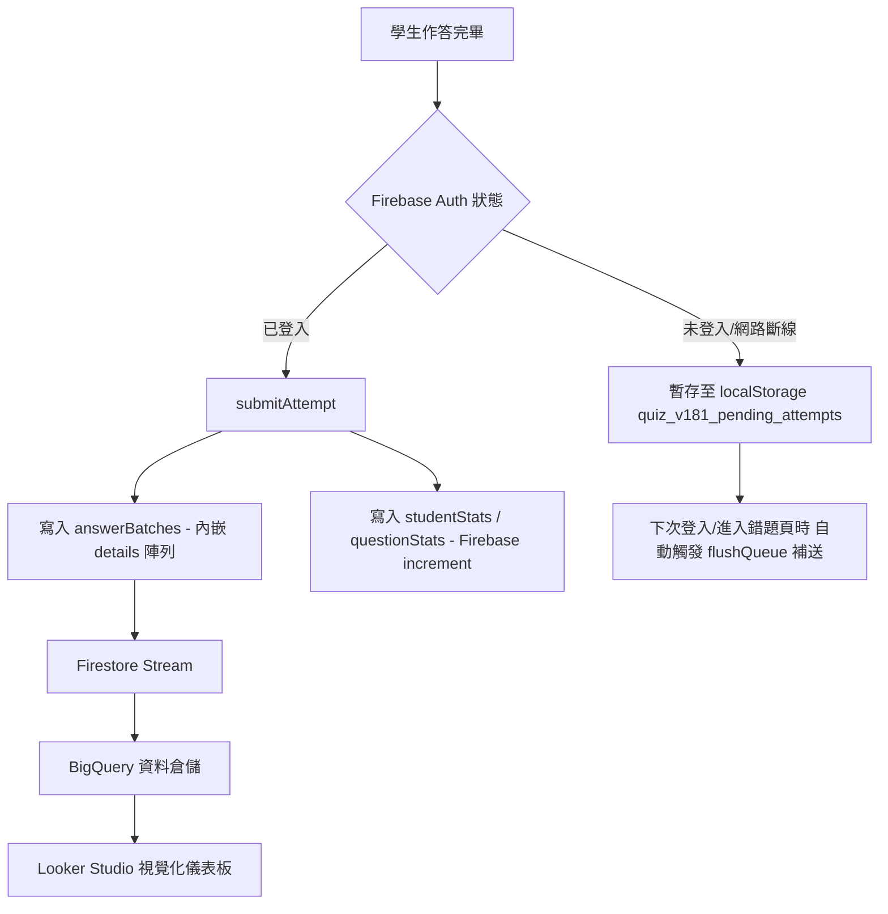

# 114-2 微免期末考系統：詳細開發歷程與變更記錄 (6/14 ～ 6/17)

本文件詳細記錄了本系統在 2026/06/14 至 2026/06/17 期間，為了因應「Google Sheet 格數爆滿危機」而進行的 **Firebase 大架構轉移**、**白名單安全登入**、以及**錯題閃卡與後台優化**的詳細開發歷程。後續若有任何開發變更，將在此文件中增量記錄。

---

## 📅 開發歷程與變更日誌 (Changelog)

### 【2026-06-17】

#### 🛠️ 1. 更新寫死的版本顯示號以防止混淆
* **Commit**: `0499ffa`
* **異動檔案**: [index.html](index.html) (版本號升級至 `?v=20260617l`)
* **變更目的**: 解決 HTML 底部的 `version-badge` 寫死在 `v2.05`，導致教師在手動更新網頁快取後，仍然看到舊版號文字而產生混淆的問題。
* **變更內容**: 將 index.html 底部的版本號文字從 `v2.05` 修正為最新的 `v2.07 (白名單特例放行版)`。

#### 🛠️ 2. 修正教師白名單警告之排除邏輯
* **Commit**: `6a877c9`
* **異動檔案**: [index.html](index.html)
* **變更目的**: 由於教師 Email (`hhchang@ctcn.edu.tw`) 在資料庫中真實不存在於 `studentsWhitelist` 集合中（因無須列入學生名冊），即便 Firestore 安全規則已對其特例放行，前端白名單自動檢測仍會無條件顯示黃色警告。本次修正直接排除教師特例之警告顯示。
* **變更內容**: 修改 `index.html` 裡的 `loadWrongFcCount` 白名單檢查條件，加上 `&& email !== "hhchang@ctcn.edu.tw"` 的排除判定，使教師登入時畫面不會再顯示礙眼的白名單警告訊息。

#### 🛠️ 3. 調整教師安全規則放行與白名單自動檢測
* **Commit**: `2c890d0`
* **異動檔案**: [firestore.rules](firestore.rules), [index.html]((index.html))
* **變更目的**: 解決教師/管理員帳號 (`hhchang@ctcn.edu.tw`) 因為沒有寫在學生的 Sheet 名冊中，在同步時沒有被寫入 Firebase `studentsWhitelist` 白名單而被 Security Rules 擋下的問題。
* **變更內容**: 
  * **安全規則放行特例**: 修改 `firestore.rules` 裡的 `inWhitelist()` 函式，除了檢查白名單集合外，特例放行 `hhchang@ctcn.edu.tw`，使其擁有等同白名單學生的 Firestore 讀寫權限。
  * **前端白名單自動檢測**: 在 `index.html` 裡的 `loadWrongFcCount` 中，實作非同步的白名單存在性檢驗，若目前登入的 Email 不在白名單中，會在畫面上印出黃色警告字眼以協助即時診斷。

#### 🛠️ 4. 暴露舊錯題庫加載錯誤訊息至前端
* **Commit**: `f30dc14`
* **異動檔案**: [index.html](index.html), [firebase-v18.js](firebase-v18.js)
* **變更目的**: 在錯題 Modal 介面上直接顯示舊錯題庫 (`wrongQuestions` 集合) 查詢時拋出的任何錯誤（例如：權限不足或缺少複合索引），協助教師與開發者精準診斷 7 天前歷史舊錯題加載失敗的原因。
* **變更內容**:
  * 在 `firebase-v18.js` 裡的 `getMyWrongQuestions` 中，捕捉舊錯題 `oldQuery.get()` 的錯誤訊息並包含在回傳物件 `_oldError` 中。
  * 在 `index.html` 裡的 `loadWrongFcCount` 中，若收到 `_oldError`，則將錯誤訊息渲染在錯題計數面板下方。

#### 🛠️ 5. 調整錯題閃卡預設時間過濾為「全部時間」
* **Commit**: `2ef503f`
* **異動檔案**: [index.html](index.html) (版本號升級至 `?v=20260617h`)
* **變更目的**: 解決學生在 6 天前（或 24 小時前）練習的暫存考卷在自動補送後，因錯題時間過濾預設為「最近 24 小時」而被過濾，導致畫面上出現「閃過補送提示但隨即顯示 0 題」的誤導狀況。
* **變更內容**: 將錯題 Modal 內的時間範圍下拉選單（`wfc-hours-select`）的預設選取項（`selected`）從「最近 24 小時」改為「全部時間」，確保使用者開啟錯題閃卡時能即刻看到所有歷史錯題。

#### 🛠️ 6. 修正錯題閃卡選項缺失 Bug
* **Commit**: `ed99c60`
* **異動檔案**: [index.html](index.html) (版本號升級至 `?v=20260617g`)
* **變更目的**: 解決進入「錯題閃卡」時因為題目沒有選項（A/B/C/D）導致閃卡在正面卡死無法操作的問題。
* **變更內容**:
  * 在首頁載入題庫（`fetchQuestionBank`）成功時，將 Firebase 拿到的完整題目儲存到全域變數 `window.firebaseQuestionsDb` 中。
  * 修改 `loadWrongFcCount`，將 `window.firebaseQuestionsDb` 作為前端「拼圖/補齊法」的第一查詢順位，確保歷史錯題的選項與解析能 100% 被完整還原。

#### 🛠️ 7. 創建獨立 Firebase 連線檢測工具
* **Commit**: `4b6267b`
* **異動檔案**: [check_fb.js](check_fb.js) (新增)
* **變更目的**: 提供教師在前端主動測試 Firebase 資料庫讀寫連線是否暢通之輕量腳本。
* **變更內容**: 建立一個獨立的 JS 工具，可用於手動觸發 Firebase 連線、登入與查詢測試，方便排除網絡或權限問題。

#### 🛠️ 8. 實作登入後本機考卷佇列補送
* **Commit**: `02eda24`
* **異動檔案**: [index.html](index.html)
* **變更目的**: 確保因網路斷線或安全性規則未發布而暫存在學生手機本機（localStorage）的考卷，能在下次成功登入後自動補送到 Firebase 上。
* **變更內容**: 於 `completeLogin` 及錯題加載時，自動調用 `flushQueue()`，將積壓的 localStorage 考卷佇列全數補送至 Firestore。

#### 🛠️ 9. 取代 GAS 登入認證為 Firestore Session 機制
* **Commit**: `6a1170e`
* **異動檔案**: [firebase-v18.js](firebase-v18.js), [index.html](index.html)
* **變更目的**: 徹底將學生的 `loginStudent` 與 `verifySession` (重複登入踢出機制) 移出 GAS，改為由 Firestore 單一文件讀寫控制，避免 GAS 連線回應過慢與踢錯新學生的 Bug。
* **變更內容**:
  * 前端全面改成讀寫 `sessions/{studentId}` 來比對 `sessionId`。
  * **Fail-Open 設計**: 若 Firebase 讀取 session 失敗，則放行不踢人，防止因雲端短暫延遲影響學生作答。

#### 🛠️ 10. 徹底排除 One Tap 登入對 GAS 的依賴
* **Commit**: `4cd9cf4`
* **異動檔案**: [firebase-v18.js](firebase-v18.js), [index.html](index.html)
* **變更目的**: 修正先前 Google One Tap (快速登入) 未與 Firebase Auth 聯動，造成無法通過 Firestore Security Rules 白名單的問題。
* **變更內容**: 修改一鍵快速登入底層，登入後強制將 Google 憑證交由 `signInWithToken` 註冊至 Firebase Auth 取得合法身份；登入卡住時也將原先誤導的 12 秒「GAS 回應慢」文字修改為正確的驗證狀態提示。

#### 🛠️ 11. 歷史舊錯題打撈與 Firestore 規則修補
* **Commit**: `4704aa7`
* **異動檔案**: [firebase-v18.js](firebase-v18.js), [firestore.rules](firestore.rules), [index.html](index.html)
* **變更目的**: 兼容 6/14 資料庫寫入量優化前的歷史舊錯題記錄，並在 rules 中補齊 missing 集合權限。
* **變更內容**: 
  * 修改 `getMyWrongQuestions`，同時查詢優化前的 `wrongQuestions` 集合與優化後的 `answerBatches`（細節內嵌）集合，並在前端過濾去重。
  * 於 `firestore.rules` 補上對 `studentProgress` 和 `wrongQuestions` 集合的讀寫權限。

#### 🛠️ 12. 更新 firebase-v18.js 快取破壞字串
* **Commit**: `a9cb9f6`
* **異動檔案**: [index.html](index.html) (版本號升級至 `?v=20260617b`)
* **變更目的**: 強迫學生瀏覽器即刻下載最新修正的 `firebase-v18.js` 錯題打撈邏輯。

#### 🛠️ 13. 前端「拼圖/補齊法」導入
* **Commit**: `23e1889`
* **異動檔案**: [index.html](index.html)
* **變更目的**: 解決 Firebase 因省空間只儲存錯題 ID，導致錯題閃卡缺少選項（A/B/C/D）與解析而無法渲染的 Bug。
* **變更內容**: 實作前端 Join，當從 Firebase 讀取到輕量的錯題 ID 後，一瞬間利用手機已加載的題庫快取資料，將選項與解析「拼裝」回閃卡。

#### 🛠️ 14. 新增 Code.gs 版本更新日誌 (10-718)
* **Commit**: `6fa8952`
* **異動檔案**: [Code.gs](Code.gs)
* **變更內容**: 於 GAS 指令碼頭部更新版本號及修改註記日誌。

#### 🛠️ 15. GAS 重構：讀取學生資料轉為 Firebase 直連
* **Commit**: `eca82df`
* **異動檔案**: [Code.gs](Code.gs)
* **變更目的**: 將原本 GAS 需要連回 Google Sheet 查詢學生成績與錯題的邏輯，改為由 GAS 連線 Firebase 取得，以提升速度。

#### 🛠️ 16. 後台升級：版本號升至 v2.1
* **Commit**: `30523ae`
* **異動檔案**: [admin.html](admin.html)
* **變更內容**: 調整後台顯示版本標誌。

#### 🛠️ 17. 修正後台學生檔案版面配置 (Tab Profile)
* **Commit**: `ccf2269`
* **異動檔案**: [admin.html](admin.html)
* **變更內容**: 將 `tab-profile` 面板正確包覆於 `teacher-content` 的 DIV 中，修正樣式跑版問題。

#### 🛠️ 18. 後台學生個人檔案面板優化
* **Commit**: `39058fc`
* **異動檔案**: [admin.html](admin.html)
* **變更目的**: 提供更好的學生個別進度查詢。
* **變更內容**: 在學生檔案面板中加上「班級篩選下拉選單」，並修正不同頁籤切換時的隱藏/顯示邏輯。

#### 🛠️ 19. 後台新增學生進度與作答軌跡原生查詢功能
* **Commit**: `c3aaab0`
* **異動檔案**: [Code.gs](Code.gs), [admin.html](admin.html)
* **變更目的**: 讓教師能在後台方便查詢單一學生的詳細作答軌跡與完成進度。
* **變更內容**: 於 GAS 新增 `getStudentProfile` API；後台 UI 新增學生個人檔案查詢頁籤，展示該學生的答題數、正確率及詳細時間。

#### 🛠️ 20. 刪除多餘的 detailSheet 檢查邏輯
* **Commit**: `dfbeb99`
* **異動檔案**: [Code.gs](Code.gs)
* **變更目的**: 因資料已完全上傳 Firebase，原 Google Sheet 的作答明細分頁已無保留必要。
* **變更內容**: 移除程式碼中對 Sheet 中 `details` 備份分頁的防呆與寫入檢查。

#### 🛠️ 21. 更新 Code.gs 版本號至 10-716
* **Commit**: `4c6f61f`
* **異動檔案**: [Code.gs](Code.gs)
* **變更內容**: 日誌更新與版本標示。

#### 🛠️ 22. 限制 Google Sheet 萬格上限：停用 details 備份
* **Commit**: `3507a5d`
* **異動檔案**: [Code.gs](Code.gs)
* **變更目的**: **解決 Google Sheet 瀕臨千萬格上限的重大危機。**
* **變更內容**: 
  * 徹底關閉交卷時將作答明細寫入 Google Sheet `SHEET_DETAILS` 的邏輯（全部改寫入 Firebase）。
  * 修正 `batchId` 遺失時的後備產出規則，確保歷史舊考卷在寫入時 ID 唯一。

#### 🛠️ 23. 修正後台 Firebase 成績補同步的引用錯誤
* **Commit**: `82fba65`
* **異動檔案**: [Code.gs](Code.gs)
* **變更目的**: 排除在手動同步 Firebase 資料回 Sheet 時的變數引用錯誤。
* **變更內容**: 修正 `handleSyncFirebaseToSheet` 函數中 `getOrCreateScoreSheet` 的 reference error。

---

### 【2026-06-16】

#### 🛠️ 1. 修正學生登入權限與 Fallback 處理
* **Commit**: `e743a37`
* **異動檔案**: [firebase-v18.js](firebase-v18.js), [firestore.rules](firestore.rules)
* **變更目的**: 解決學生未完全註冊成功時登入被 Firestore rules 阻擋的問題。
* **變更內容**: 調整 `verifySession` 邏輯為 fail-open，且允許在特定安全檢查失敗時採用本機 Fallback 登入狀態。

#### 🛠️ 2. 後台新增手動同步 Firebase 成績至 Sheet 功能
* **Commit**: `4aa5962`
* **異動檔案**: [admin.html](admin.html)
* **變更內容**: 於後台管理介面新增「💾 補齊缺失的 Firebase 成績至 Sheet」按鈕，方便教師隨時手動強制備份。

#### 🛠️ 3. 修正後台「全體正確率」計算錯誤 (顯示為 0%)
* **Commit**: `31e4a9f`
* **異動檔案**: [admin.html](admin.html), [firebase-v18.js](firebase-v18.js)
* **變更目的**: 解決因資料庫優化導致部分考卷資料為空時，後台全體正確率會直接除以 0 計算出 0% 的顯示錯誤。
* **變更內容**: 優化累加邏輯，排除空考卷之干擾。

#### 🛠️ 4. 移除後台不必要的 Firebase SDK 載入
* **Commit**: `cf26a21`
* **異動檔案**: [admin.html](admin.html), [firestore.rules](firestore.rules)
* **變更目的**: 簡化後台代碼，避免與前端腳本載入衝突，並收緊 Firestore 安全規則。

#### 🛠️ 5. 後台管理介面整合 Looker Studio 儀表板
* **Commit**: `0539db7`
* **異動檔案**: [admin.html](admin.html)
* **變更目的**: 提供教師無感、直接的圖表數據 analysis 體驗。
* **變更內容**: 以 iframe 原生方式直接將 Looker Studio 儀表板整合在教師後台頁面中。

#### 🔒 6. 實作 Firebase Whitelist (白名單安全防護)
* **Commit**: `fe470dd`
* **異動檔案**: [Code.gs](Code.gs), [firebase-v18.js](firebase-v18.js), [firestore.rules](firestore.rules)
* **變更目的**: **核心資安升級。** 限制只有白名單內的合法學生才能讀寫 Firebase，防堵外部惡意寫入與盜刷。
* **變更內容**:
  * **GAS 同步白名單**: 修改 `Code.gs`，在教師點選「同步資料到 Firebase」時，自動將 Sheet 中的學生資料寫入 Firestore 的 `studentsWhitelist` 集合（文件 ID 設為小寫 Email）。
  * **安全規則綁定**: 在 `firestore.rules` 中新增 `inWhitelist()` 函式，要求讀寫 `answerBatches` 必須同時滿足 `signedIn()` 與 `inWhitelist()`，且 Email 必須相符。
  * **學生基本資料查詢優化**: 修改 `findStudentByEmail`，改為直接至 Firestore 查詢白名單文件，讓登入回應速度達到「毫秒級」。

---

### 【2026-06-14】

#### 🛠️ 1. 後台統計圖表：新增學生過濾器
* **Commit**: `71d8497`
* **異動檔案**: [admin.html](admin.html)
* **變更內容**: 於後台趨勢圖表中新增「學生個人篩選」下拉選單，可單獨看某位學生的答題時間與次數趨勢。

#### 🛠️ 2. 後台統計圖表：支援每小時連續折線與動態班級篩選
* **Commit**: `2520f2a`
* **異動檔案**: [admin-firebase.js](admin-firebase.js), [admin.html](admin.html)
* **變更內容**: 將原本的趨勢圖改為 24 小時連續折線圖，並可依據班級動態篩選數據。

#### 🛠️ 3. 創建 JSON 測試工具
* **Commit**: `e6ba61b`
* **異動檔案**: [testParse.js](testParse.js) (新增)
* **變更內容**: 用於在本機測試與解析 Firestore 傳回的打包 questions 的格式。

#### 🛠️ 4. 修正後台 attempts 未定義導致的顯示錯誤
* **Commit**: `c0445d2`
* **異動檔案**: [admin-firebase.js](admin-firebase.js), [admin.html](admin.html)
* **變更內容**: 於後台 attempts 屬性為空時給予預設值，並加上管理版號標示。

#### 🛠️ 5. 後台統計圖表：新增每日答題次數與平均時間趨勢圖
* **Commit**: `e112a02`
* **異動檔案**: [admin-firebase.js](admin-firebase.js), [admin.html](admin.html)
* **變更內容**: 引入 Chart.js，在教師後台繪製作答量與用時之每日變化折線圖。

#### 🛠️ 6. 調整 admin-firebase.js 傳回結構以符合 UI 期待
* **Commit**: `cc2c526`
* **異動檔案**: [admin-firebase.js](admin-firebase.js)
* **變更內容**: 修改後台專屬 Firebase 通訊模組，使其輸出的變數與 admin.html 的繪圖函式完全對接。

#### 🛠️ 7. 管理端繞過限制：經由 GAS REST API 拉取後台成績
* **Commit**: `8220651`
* **異動檔案**: [Code.gs](Code.gs), [admin-firebase.js](admin-firebase.js)
* **變更目的**: 解決因 Security Rules 限制，導致後台難以直接以 Client 身份抓取全體學生成績的問題。
* **變更內容**: 於 GAS 端建立 REST 轉發接口，後台改以呼叫 GAS 來拉取 Firestore 的成績明細進行報表分析。

#### 🛠️ 8. 修正 Firebase 設定變數名稱錯誤
* **Commit**: `0259d56`
* **異動檔案**: [admin-firebase.js](admin-firebase.js)
* **變更內容**: 將呼叫時誤植的變數更正為正確的全域配置 `FIREBASE_V18_CONFIG`。

#### 🛠️ 9. 修正後台重複登入報表整合
* **Commit**: `c25a4c6`
* **異動檔案**: [admin.html](admin.html)
* **變更內容**: 對接後台 `getDuplicateLoginReport` 函數之 DOM 元素。

#### 🛠️ 10. 建立 admin-firebase.js 核心通訊模組
* **Commit**: `bfa2a1a`
* **異動檔案**: [admin-firebase.js](admin-firebase.js) (新增), [admin.html](admin.html)
* **變更目的**: 提供後台專用的 Firebase 通訊機制。
* **變更內容**: 新增 `admin-firebase.js` 用於處理後台專屬的 Bootstrap 載入、學生管理、以及同步觸發。

#### 🛠️ 11. GAS 實作：補成績 REST API 端點
* **Commit**: `29b9c4f`
* **異動檔案**: [Code.gs](Code.gs)
* **變更目的**: 提供一鍵將 Firebase 上的成績補寫入至 Google Sheet 的後端程序。
* **變更內容**: 於 GAS 端完整實作 `syncFirebaseToSheet` REST 處理邏輯，依據 Firebase 傳回的 `answerBatches` 逐一檢查並補填 Google Sheet 缺失的列。

#### 🛠️ 12. 錯題加載：增加 Snap 尺寸與 Fallback 時間除錯日誌
* **Commit**: `eba6c14`
* **異動檔案**: [firebase-v18.js](firebase-v18.js), [index.html](index.html)
* **變更內容**: 於前端 console 印出 `snap.size` 以及當 `createdAt` 遺失時，回退採用 `endedAtClient` 之除錯日誌。

#### 🛠️ 13. 錯題 Modal 新增除錯數字標記
* **Commit**: `e6d5394`
* **異動檔案**: [index.html](index.html)
* **變更內容**: 在錯題閃卡 Modal 底部以小字印出「掃描了 X 份考卷」之除錯標記。

#### 🛠️ 14. 錯題加載效能優化：一次撈取 + 前端過濾
* **Commit**: `51ca54f`
* **異動檔案**: [firebase-v18.js](firebase-v18.js), [index.html](index.html)
* **變更目的**: 解決原本在 Firebase 端對多欄位做時間過濾時，因需要建立複合索引（Composite Index）而導致的查詢失敗與 parameter 映射 Bug。
* **變更內容**: 移除 Firebase 端的 limit 與 time where 條件，改為一次把該 Email 考卷全數拉回，由前端 JS 用毫秒數進行極速的時間過濾。

#### 🛠️ 15. 修正前端錯題查詢呼叫參數錯誤
* **Commit**: `74f5ded`
* **異動檔案**: [index.html](index.html)
* **變更內容**: 移除前端呼叫 `getMyWrongQuestions` 時誤傳的 `studentId` 參數（該函式在 Firebase 端已改為以 auth.currentUser 的 email 為主鍵）。

#### 🛠️ 16. 前端版號升級至 v2.01
* **Commit**: `fb58635`
* **異動檔案**: [index.html](index.html)
* **變更內容**: 前端 UI 版號升級。

#### 🛠️ 17. 修正錯題篩選邏輯：正確匹配綜合練習
* **Commit**: `cc7489a`
* **異動檔案**: [firebase-v18.js](firebase-v18.js)
* **變更目的**: 修正從「綜合練習」中抽出的錯題，在前端依分類勾選過濾時無法正確匹配的問題。
* **變更內容**: 改為依據每題獨立的 `topic` 進行比對，而非看整張考卷的 `topic`。

#### 🛠️ 18. 徹底移除對 Firestore 複合索引的要求
* **Commit**: `525350d`
* **異動檔案**: [firebase-v18.js](firebase-v18.js)
* **變更目的**: 排除在資料庫大搬家後，因沒有手動在 Firebase Console 建立複合索引而產生的查詢失敗。
* **變更內容**: 將複合查詢拆解為單一 query。

#### 🛠️ 19. 前端版號升級至 v2.00
* **Commit**: `6a0a389`
* **異動檔案**: [index.html](index.html)
* **變更內容**: **標誌 Firebase 核心大轉移完成之重大版本。**

#### 🛠️ 20. 修正錯題加載之日期比較跨型別 Bug
* **Commit**: `03abeba`
* **異動檔案**: [firebase-v18.js](firebase-v18.js)
* **變更目的**: **解決 6/14 前端加載顯示 0 題的重大 Bug。**
* **變更內容**: 修正先前使用「ISO 字串」與「Firestore Timestamp」物件做大小比對的邏輯錯誤。

#### 🚀 21. 全面去 GAS 化：轉移至 Firebase (首個大遷移 Commit)
* **Commit**: `335b150`
* **異動檔案**: [Code.gs](Code.gs), [firebase-v18.js](firebase-v18.js), [firestore.rules](firestore.rules), [index.html](index.html)
* **變更目的**: **高速公路行駛中換輪胎的大型架構升級。** 解決 Google Sheet 容量即將爆滿千萬格上限的重大危機，將所有作答記錄上傳至 Firebase 雲端。
* **變更內容**:
  * **寫入整併**: 將原本分開的作答明細，改以內嵌在 `answerBatches` document 的 Map Array 中打包上傳，極致節省寫入量。
  * **Firebase SDK 引入**: 於前端 `index.html` 引入 Firebase app, auth, firestore compat SDK，並編寫 `firebase-v18.js` 通訊的核心邏輯。
  * 部署最初版 `firestore.rules` 規則。

---

## 🎯 重要架構設計演進

### 1. 寫入量極致優化（內嵌 Details 設計）
* **舊設計**: 學生交一張考卷，會寫入 1 筆 `answerBatches`，並對考卷內每一題寫入 1 筆 `answerDetails`（若 30 題就是 31 次寫入），資料庫開銷極大。
* **新設計**: 將作答明細轉為 JSON 陣列，直接作為 `details` 欄位寫入 `answerBatches` 本身，**一次交卷僅需 1 次寫入**。
* **前端拼圖法**: 為了省空間，Firebase 上的明細不存題目選項與解析。前端載入時，直接透過全庫變數 `window.firebaseQuestionsDb` 的 `id`對照表，將選項與解析瞬間「拼裝」回畫面上。

### 2. 兩階段安全驗證與 Fail-Open 機制
* **第一階段**：Google 登入取得的 Email 必須存在於 Firestore 的 `studentsWhitelist` 集合中（由老師在 Sheet 管理，並同步至 Firebase）。
* **第二階段**：使用 Firestore Session Doc (`sessions/{studentId}`) 來取代 GAS 以前的 token 比對，限制單一帳號只能在單一裝置登入。
* **Fail-Open 設計**：若 Firebase 遭遇網路異常或 rules 讀取失敗，驗證程序會採取「放行繼續」策略，不影響學生考試進行。

---

> [!NOTE]
> 本文件為增量更新文件，後續若有開發新功能或修復 Bug，請接續於最上方【開發歷程與變更日誌】中新增日誌區段。
